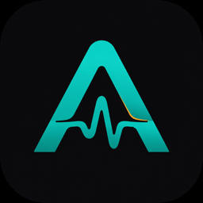

  

<h1 align="center">Oration</h1>

  <strong>Video you can feel.</strong> 
  We build <a href="https://auraversion.com">Aura</a> — haptic trailers, Shorts, and Worlds — 
  and <a href="https://hapticcore.app">Studio</a>, the timeline that authors every tap.

  
  
  
  

  
  
  
  
  

---

## Products

| | Product | What it is | Get it |
| :---: | :--- | :--- | :--- |
|  | **Aura** | Watch trailers, Shorts, and Worlds with synchronized Core Haptics | [App Store](https://apps.apple.com/app/id6790475204) · [Google Play](https://play.google.com/store/apps/details?id=com.aurahaptic.app) · [Web](https://auraversion.com) |
| | **HapticCore Studio** | Desktop DAW for Apple `.ahap` — events, curves, AI generate, live preview | [macOS](https://hapticcore.app/download/mac) · [Windows](https://hapticcore.app/download/windows) · [Site](https://hapticcore.app) |
| | **HapticCore Preview** | Feel the timeline on a real phone over local Wi‑Fi — nothing uploaded | [App Store](https://apps.apple.com/app/id6790292327) · [Play Store](https://play.google.com/store/apps/details?id=com.hapticcore.preview) |

One pipeline: **Studio authors the feel → Preview proves it on device → Aura ships it to audiences.**

---

## Download

<table>
  <tr>
    <td align="center" width="50%" valign="top">
      <h3>Aura — watch</h3>
      
Haptic video on iPhone and Android.

      

         
        
      

    </td>
    <td align="center" width="50%" valign="top">
      <h3>Studio + Preview — create</h3>
      
Author on desktop. Feel it on phone.

      

        <a href="https://hapticcore.app/download/mac"><strong>↓ macOS</strong></a>
        &nbsp;·&nbsp;
        <a href="https://hapticcore.app/download/windows"><strong>↓ Windows</strong></a>
      

      

        
      

    </td>
  </tr>
</table>

---

## Consoles

For film teams, advertisers, and platform staff.

| Console | Who it's for | Link |
| :--- | :--- | :--- |
| **Aura Studio Admin** | Architects & orgs — upload, Worlds, billing, analytics | [admin.auraversion.com](https://admin.auraversion.com) |
| **Aura Ads** | Advertisers — campaigns, haptic creatives, spend | [ads.auraversion.com](https://ads.auraversion.com) |
| **Super Admin** | Staff only — trust & safety, users, flags, ads review | Internal (`apps/aura-super-admin`) |
| **Marketing** | Public site, pricing, docs, account | [auraversion.com](https://auraversion.com) |
| **API** | Mobile & Studio backends | [api.auraversion.com](https://api.auraversion.com/healthz) |

---

## Quick links

<strong>Aura</strong> — site, account, docs

 

| | |
| :--- | :--- |
| Home | [auraversion.com](https://auraversion.com) |
| Trailers | [auraversion.com/trailers](https://auraversion.com/trailers) |
| Studio | [auraversion.com/studio](https://auraversion.com/studio) |
| Features | [auraversion.com/features](https://auraversion.com/features) |
| Pricing | [auraversion.com/pricing](https://auraversion.com/pricing) |
| Docs | [auraversion.com/documentation](https://auraversion.com/documentation) |
| Blog | [auraversion.com/blog](https://auraversion.com/blog) |
| Releases | [auraversion.com/releases](https://auraversion.com/releases) |
| Account | [auraversion.com/account](https://auraversion.com/account) |
| Support | [auraversion.com/support](https://auraversion.com/support) |
| Contact | [auraversion.com/contact](https://auraversion.com/contact) |

<strong>Stores</strong> — App Store, Play, desktop

 

| App | Store | Bundle / package |
| :--- | :--- | :--- |
| Aura iOS | [apps.apple.com/app/id6790475204](https://apps.apple.com/app/id6790475204) | `com.aurahaptic.app` |
| Aura Android | [play.google.com/…/com.aurahaptic.app](https://play.google.com/store/apps/details?id=com.aurahaptic.app) | `com.aurahaptic.app` |
| Preview iOS | [apps.apple.com/app/id6790292327](https://apps.apple.com/app/id6790292327) | `com.hapticcore.preview` |
| Preview Android | [Play listing](https://play.google.com/store/apps/details?id=com.hapticcore.preview) | `com.hapticcore.preview` |
| Studio macOS | [hapticcore.app/download/mac](https://hapticcore.app/download/mac) | `com.aurahaptic.studio` |
| Studio Windows | [hapticcore.app/download/windows](https://hapticcore.app/download/windows) | `com.aurahaptic.studio` |

<strong>Legal & contact</strong>

 

| | Aura | Studio |
| :--- | :--- | :--- |
| Privacy | [auraversion.com/privacy](https://auraversion.com/privacy) | [hapticcore.app/privacy](https://hapticcore.app/privacy) |
| Terms | [auraversion.com/terms](https://auraversion.com/terms) | — |
| Support | [auraversion.com/support](https://auraversion.com/support) | [hapticcore.app/support](https://hapticcore.app/support) |
| Email | [support@auraversion.com](mailto:support@auraversion.com) · [hello@auraversion.com](mailto:hello@auraversion.com) · [ads@auraversion.com](mailto:ads@auraversion.com) | [support@hapticcore.app](mailto:support@hapticcore.app) |

---

## Repositories

| Repo | Role |
| :--- | :--- |
| [hapticcore-studio](https://github.com/hapticcore/hapticcore-studio) | Aura + Studio monorepo (apps, SDKs, microservices) |
| [studio-deps](https://github.com/hapticcore/studio-deps) | Public Studio runtime components (FFmpeg, FFprobe, ML sidecar) |

---

  © 2026 TECHPOD AI DATASERVICE PRIVATE LIMITED 
  Aura is owned and operated by TECHPOD AI DATASERVICE PRIVATE LIMITED. 
  <a href="https://auraversion.com">auraversion.com</a> · <a href="https://hapticcore.app">hapticcore.app</a>

